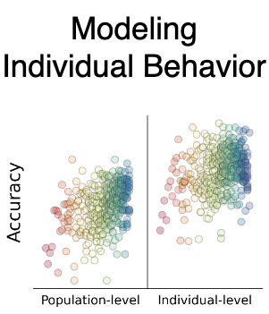

# Learning Models of Individual Behavior in Chess

## [website](https://maiachess.com)/[paper](https://arxiv.org/abs/2008.10086)/[code](https://github.com/CSSLab/maia-individual)

<p align="center">
  <a href="https://arxiv.org/abs/2008.10086"></a>
</p>

## Overview

The main code used in this project is stored in `backend` which is setup as a Python package, running `python setup.py install` will install it. Then the various scripts can be used. We also recommend using the virtual env config we include in `environment.yml` as some packages are required to be up to date. In addition for generating training data two more tools are need [`pgn-extract`](https://www.cs.kent.ac.uk/people/staff/djb/pgn-extract/) to clean the PGNs and [`trainingdata-tool`](https://github.com/DanielUranga/trainingdata-tool) to convert them into training data.

To run a model as a chess engine [`lco`](https://github.com/LeelaChessZero/lc0}{github.com/LeelaChessZero/lc0) version 23 has been tested and should work with all models (you can specify a path to a model with the `-w` argument).

All testing was done with Ubuntu 18.04 with CUDA Version 10.

## Models

We do not have any public models of players publicly available at this time. This is because of the stylometry results shown in section 5.2 of the paper we cannot release anonymous models.

We have included the maia model, from [https://github.com/CSSLab/maia-chess](https://github.com/CSSLab/maia-chess) that was used as the base.

## Running the code

The code for this project is divided into different sections, each has a series of shell scripts that are numbered. If ran in order the training data, then final models can be generated. For the full release we plan to have the process to generate a model more streamlined.

### Quick Run

To get the model for a single player from a single PGN a simpler system can be used first

1. Run `1-data_generation/9-pgn_to_training_data.sh input_PGN_file output_directory player_name`
2. Create a config file by copying `2-training/final_config.yaml` and adding `output_directory` and `player_name`
3. Run `python 2-training/train_transfer.py path_to_config`
4. The final model will be written to `final_models`, read the `--help` for more information

### Full Run

For all scripts if applicable they start with a list of variables, these will need to be edited to match the paths on your system.

The list of players we used was selected using the code in `0-player_counting`. The standard games from lichess [database.lichess.org](database.lichess.org) up to April are required to get our exact results but it should work with other sets, even non-Lichess ones with a bit of work.

Then the players games are extracted and the various sets are constructed from them in `1-data_generation`.

Finally `2-training` has the main training script along with a configuration file that specifies the hyper parameters. All four discussed in the main text are included.

### Extras

The analysis code (`3-analysis`) is included for completeness, but as it is for generating the data used in the plots and relies on various hard coded paths we have not tested it. That said `3-analysis/prediction_generator.py` is the main workhorse and has a `--help`, note it is designed for on files output by `backend.gameToCSVlines`, but less complicated csvs could be used.

The baseline models code and results are in `4-cp_loss_stylo_baseline` this is a simple baseline model to compare our results to, and is included for completeness.

## Reduced Data

The model configurations for the reduced data training are included in `9-reduced-data/configs` To train them yourself simply use the configs in the quick run training.

## Citation

```
@article{McIlroyYoung_Learning_Models_Chess_2022,
author = {McIlroy-Young, Reid and Sen, Siddhartha and Kleinberg, Jon and Anderson, Ashton},
doi = {10.1145/3534678.3539367},
journal = {KDD '22: Proceedings of the 28th ACM SIGKDD International Conference on Knowledge Discovery & Data Mining},
month = {8},
title = {{Learning Models of Individual Behavior in Chess}},
year = {2022}
}
```

## License

The software is available under the GPL License and includes code from the [Leela Chess Zero](https://github.com/LeelaChessZero/lczero-training) project.

## Contact

Please [open an issue](https://github.com/CSSLab/maia-individual/issues/new) or email [Reid McIlroy-Young](https://reidmcy.com/) to get in touch
